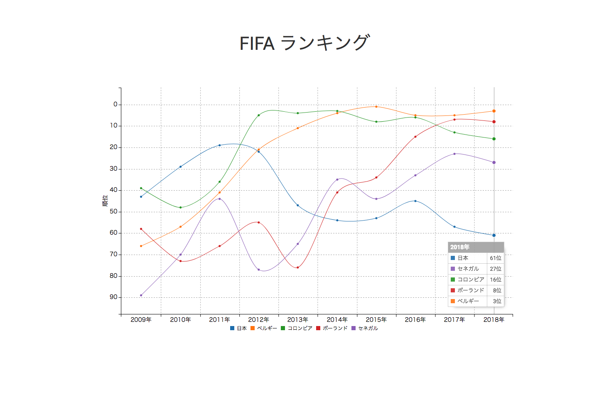

# FIFA-Ranking - FIFAランキング可視化

<br>



<br>
<br>
<br>

## Package

- Node.js v9.2.0
- npm v5.5.1

- c3 v0.6.2
- d3 v5.5.0
- jquery v2.1.4
- materialize-css v0.100.2
- ress v1.2.2
- webpack v3.5.4
- webpack-dev-server v2.7.1
- css-loader v0.28.11
- file-loader v1.1.11
- style-loader v0.21.0
- url-loader v1.0.1

<br>

## Quick Start

Install package

```

npm install

```

<br>

build

```

npm run build

```

<br>

dev

```

npm run dev

```

---

<br>
<br>

## License
MIT

Copyright (c) 2018 sober

<br>


